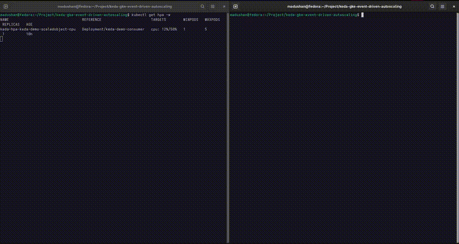

# KEDA GKE Event-Driven Autoscaling

> Kubernetes workloads that scale from **zero to N and back to zero**, driven entirely by GCP Pub/Sub queue depth — not CPU/memory.

Most Kubernetes autoscaling (HPA) reacts to CPU and memory. That's a poor proxy for workloads like queue consumers, where a pod can sit at 2% CPU while a backlog of 10,000 unprocessed messages builds up. This project uses [KEDA](https://keda.sh) to scale a Kubernetes Deployment directly off Pub/Sub subscription backlog — including scaling to **zero replicas** when there's no work, which HPA cannot do on its own.

---

## Architecture

```
┌──────────────────────────────────────────────────────────────────┐
│  publisher.py                                                     │
│  Simulates event traffic: steady / burst / ramp load patterns     │
└───────────────────────────┬────────────────────────────────────── ┘
                             │ publishes
┌────────────────────────────▼───────────────────────────────────────┐
│  GCP Pub/Sub                                                       │
│  Topic: keda-demo-topic → Subscription: keda-demo-topic-subscription│
└────────────────────────────┬───────────────────────────────────────┘
                             │ polled every 5s
┌────────────────────────────▼───────────────────────────────────────┐
│  KEDA (installed via Helm)                                         │
│  ScaledObject watches subscription backlog                        │
│  minReplicas: 0 → maxReplicas: 10                                  │
└────────────────────────────┬───────────────────────────────────────┘
                             │ scales
┌────────────────────────────▼───────────────────────────────────────┐
│  GKE Autopilot                                                     │
│  Deployment: keda-demo-consumer                                    │
│  consumer.py — pulls messages, simulates variable work, acks       │
│  Auth: GCP Workload Identity (no static keys)                     │
└──────────────────────────────────────────────────────────────────┘
```

---

## Why This Exists

This started as a rebuild of a public KEDA/GKE reference repo that used a now-deprecated GCP auth pattern (`podIdentity`) and a synthetic load generator that just published the same string in a `while true` loop. The rebuild:

- Replaces deprecated auth with **GCP Workload Identity**
- Replaces the flat load loop with **three realistic traffic patterns** (steady, burst, ramp) so scaling behavior is actually visible and demoable
- Adds a **consumer that simulates variable processing time**, instead of an instant ack, so the autoscaling curve reflects real workload behavior
- Adds **tests, CI, and CD** — none of which existed in the original reference implementation

---

## Quick Start (Local Dev, No GCP Needed)

### Prerequisites

- Python ≥ 3.10
- Docker
- (Optional, for full local K8s testing) `kind` or `minikube` + `kubectl` + `helm`

### 1. Clone and install

```bash
git clone https://github.com/madushansivam/keda-gke-event-driven-autoscaling.git
cd keda-gke-event-driven-autoscaling
python3 -m venv venv
source venv/bin/activate
pip install -r app/requirements-dev.txt
```

### 2. Run unit tests (no GCP credentials required)

```bash
python -m pytest app/tests/ -v
```

### 3. Run against the Pub/Sub emulator (no live GCP project needed)

```bash
docker run -d -p 8085:8085 google/cloud-sdk:emulators \
  gcloud beta emulators pubsub start --host-port=0.0.0.0:8085
export PUBSUB_EMULATOR_HOST=localhost:8085
python -m pytest app/tests/test_publisher_integration.py -v
```

---

## Full Deploy (GKE + KEDA)

Full step-by-step setup — including GCP project creation, Workload Identity, GKE Autopilot, KEDA install via Helm, and the ScaledObject — is documented in [`docs/DEPLOY.md`](docs/DEPLOY.md).

Once deployed, trigger a scaling demo:

```bash
# Terminal 1: watch pods scale live
kubectl get pods -w

# Terminal 2: generate a burst of load
export GCP_PROJECT_ID=<your-project-id>
export TOPIC_NAME=keda-demo-topic
python app/publisher.py --mode burst
```

Pods scale from 0 → up to 10 as the queue fills, then back to 0 after the configured cooldown period with no backlog.



---

## What This Does and Doesn't Demonstrate

**What it reliably demonstrates:**
- Event-driven (not resource-driven) autoscaling on Kubernetes
- Scale-to-zero, which native HPA cannot do
- Secure, keyless GCP authentication from GKE via Workload Identity
- A working CI/CD pipeline in both GitHub Actions and Jenkins, testing and deploying the same codebase

**What it does not attempt to demonstrate:**
- Production-scale message throughput or load testing at volume
- Multi-region or multi-cluster failover
- Cost optimization beyond scale-to-zero (no FinOps tooling)

This is a learning and portfolio project — a clean, correct reference implementation, not a production system.

---

## Tech Stack

| Layer | Tool |
|---|---|
| Language | Python 3.12 |
| Messaging | GCP Pub/Sub |
| Autoscaling | KEDA 2.x (Helm) |
| Orchestration | Google Kubernetes Engine (Autopilot) |
| Auth | GCP Workload Identity Federation |
| Containerization | Docker (multi-stage, non-root) |
| Testing | pytest, pytest-cov, Pub/Sub emulator |
| CI | GitHub Actions |
| CI (secondary) | Jenkins |
| CD | GitHub Actions → GKE (`kubectl set image`) |

---

## Project Structure

```
keda-gke-event-driven-autoscaling/
├── app/
│   ├── publisher.py          # Load generator: steady/burst/ramp patterns
│   ├── consumer.py           # Pub/Sub consumer with simulated work time
│   ├── requirements.txt
│   ├── requirements-dev.txt
│   └── tests/
│       ├── test_consumer.py
│       └── test_publisher_integration.py
├── k8s/
│   ├── service-account.yaml  # Workload Identity-bound KSA
│   ├── deployment.yaml       # Consumer Deployment with resource limits
│   └── keda-scaledobject.yaml
├── .github/workflows/
│   └── ci.yml                # test → build → deploy
├── Jenkinsfile
├── Dockerfile                # Multi-stage, non-root
└── docs/
    ├── DEPLOY.md              # Full GCP + GKE + KEDA setup
    └── gcp-setup.md
```

---

## What I Learned

- Why HPA's resource-based model breaks down for queue-consumer workloads, and how KEDA closes that gap using external metrics adapters
- GCP Workload Identity Federation as the modern replacement for both service account keys and the older node-level Pod Identity pattern
- How to design a load generator with distinct traffic shapes (steady/burst/ramp) instead of a flat loop, to make scaling behavior demoable and testable
- Structuring a Python service to be testable independent of live cloud credentials, using the Pub/Sub emulator for integration tests
- Running the same pipeline through two different CI tools (GitHub Actions, Jenkins) to understand the tradeoffs of hosted vs. self-managed CI

---

## License

MIT
